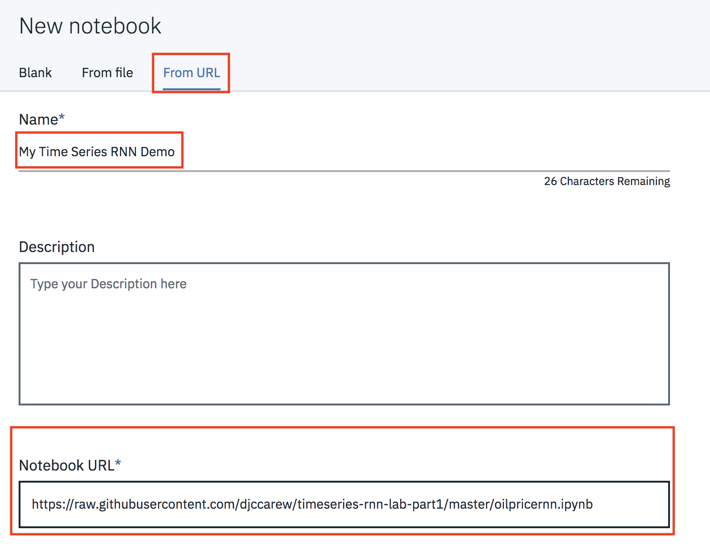
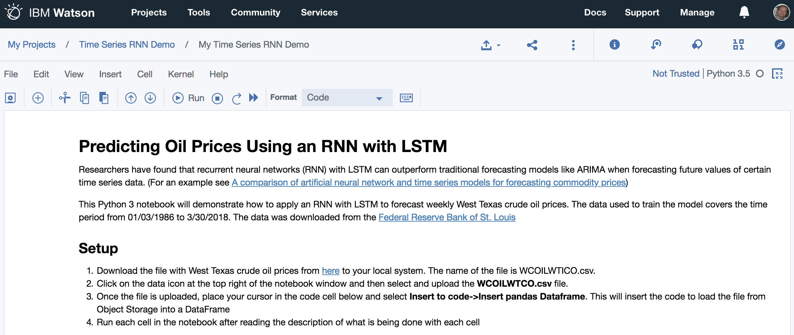

#  Predicting Oil Prices Using an RNN with Watson Studio

## Part 1 - Building and running the model

Researchers have found  that recurrent neural networks (RNN) can outperform traditional forecasting models like ARIMA when  forecasting relatively short term future values of certain  time series data. (For an example see [A comparative study of neural network and Box-Jenkins ARIMA modeling in time series prediction](https://www.sciencedirect.com/science/article/abs/pii/S0360835202000360))

This Watson Studio lab  will demonstrate how to apply an RNN with LSTM to forecast weekly West Texas crude oil prices. The data used to train the model covers the time period  from 01/03/1986 to 3/30/2018. The data  was downloaded from the [Federal Reserve Bank of St. Louis](https://fred.stlouisfed.org)

##  Setup

### 1 Sign up for Watson Studio

If you are not already signed up for Watson Studio, [sign up here](https://www.ibm.com/cloud/watson-studio)

### 2 Create a Watson Studio Project

2.1 From the Watson Studio home page click on **New Project**


2.2 Select a **Standard** project type and click **Create Project**


2.3 Name the project *Time Series RNN Demo*

2.4 if you already have an Object Storage  instance associated with your project, click **Create** and go to Step 3.1

2.5 Else click on **Add** to add an Object Storage instance to your Watson Studio Instance. This will be used to permanently store any data that you upload to Watson Studio

2.6 Accept the defaults, scroll down and click the **Create** button. Click **Confirm**.

2.7 Click **Refresh** to load the details of the new Object Storage instance and then click **Create**


### 3. Create  and run this lab's notebook

3.1 Click on  **Add to project** and then select **Notebook**


3.2 Name the Notebook *My Time Series RNN Demo* . Select **From URL** and copy the following URL into the **Notebook URL** field

```
https://raw.githubusercontent.com/djccarew/timeseries-rnn-lab-part1/master/oilpricernn.ipynb```


```

3.3 After a few seconds the notebook should be loaded


3.4 Follow the instructions in the notebook to complete the exercise.
